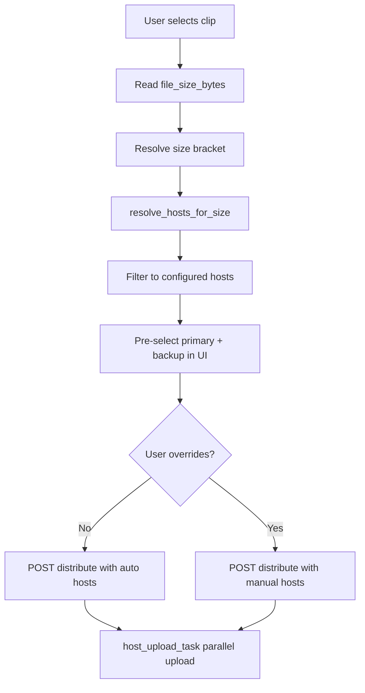

# PPD Size-Based Auto-Routing Plan

## Goal

When a user distributes a clip, the system reads the clip file size, maps it to a size bracket, and **auto-selects primary + backup hosts** from the three hosts already integrated. The user can override checkboxes before uploading.

## Adapted Host Mapping (3 hosts only)

The guide references KatFile, Rapidgator, Uploady, etc. Since scope is **existing hosts only**, map guide intent to what you have:

| Bracket | File size | Primary | Backup | Rationale |
|---------|-----------|---------|--------|-----------|
| Small | 0–500 MB | Uploadrar | Up-4ever | Matches guide Tier 1 |
| Medium | 500 MB–1 GB | Uploadrar | Up-4ever | Matches guide primary/backup |
| Large | 1–2 GB | Up-4ever | Uploadrar | Guide: KatFile + Up-4ever → Up-4ever is backup |
| XL | 2–5 GB | Up-4ever | KrakenFiles | Guide: Rapidgator tier → Up-4ever best XFS fit |
| XXL | 5–10 GB | KrakenFiles | Up-4ever | Guide: very large → KrakenFiles |
| Archive | 10 GB+ | KrakenFiles | — | Guide: 20 GB+ archive hosts |

Only **configured** hosts are returned; if backup is missing/unconfigured, primary alone is used.



---

## Backend Changes

### 1. Central routing module (new file)

Create [`backend/app/services/ppd_routing.py`](backend/app/services/ppd_routing.py) as the **single source of truth** for:

- Size bracket definitions (name, min/max bytes, folder label e.g. `500MB-1GB`)
- Primary/backup host mapping per bracket
- `resolve_hosts_for_size(size_bytes: int, configured_hosts: set[str]) -> dict` returning:
  - `bracket`, `primary`, `backup`, `recommended_hosts[]`, `size_bytes`
- `get_clip_size_bytes(clip: Clip) -> int | None` — uses stored field or `Path.stat()` fallback

This replaces scattered `HOST_KEYS` logic over time; initially consumed by API + task layer.

### 2. Clip model — store file size

Add to [`backend/app/models/clip.py`](backend/app/models/clip.py):

```python
file_size_bytes: int | None = None
```

Set in [`backend/app/tasks/clip_task.py`](backend/app/tasks/clip_task.py) after `shutil.copy2(upload_path, saved_clip_path)` (~line 218):

```python
clip.file_size_bytes = Path(saved_clip_path).stat().st_size
```

Also set in [`backend/app/tasks/host_upload_task.py`](backend/app/tasks/host_upload_task.py) `_ensure_local_clip()` when downloading from Cloudinary (for legacy clips missing the field).

### 3. Host registry refactor (minimal)

Refactor [`backend/app/tasks/host_upload_task.py`](backend/app/tasks/host_upload_task.py) to import `HOST_KEYS` and `_get_host_service` from `ppd_routing.py` (or a thin `host_registry.py`) so adding metadata later doesn't require editing 5 files.

Keep the existing upload services unchanged:
- [`backend/app/services/xfs_upload_service.py`](backend/app/services/xfs_upload_service.py) — Uploadrar, Up-4ever
- [`backend/app/services/krakenfiles_service.py`](backend/app/services/krakenfiles_service.py)

### 4. API changes

In [`backend/app/api/v1/publishing.py`](backend/app/api/v1/publishing.py):

**a) New endpoint** — `GET /clips/{clip_id}/distribute/recommendations`

Returns bracket + recommended hosts for the selected clip:

```json
{
  "size_bytes": 842000000,
  "bracket": { "name": "Medium", "label": "500MB-1GB" },
  "primary": "uploadrar",
  "backup": "up4ever",
  "recommended_hosts": ["uploadrar", "up4ever"],
  "all_hosts": [
    { "key": "uploadrar", "label": "Uploadrar", "configured": true, "role": "primary" },
    { "key": "up4ever", "label": "Up-4ever", "configured": true, "role": "backup" },
    { "key": "krakenfiles", "label": "KrakenFiles", "configured": false, "role": null }
  ]
}
```

**b) Extend `DistributeBody`**

```python
class DistributeBody(BaseModel):
    hosts: list[str] | None = None   # explicit override
    mode: Literal["auto", "manual"] = "auto"
```

- `mode=auto` + empty `hosts` → server calls `resolve_hosts_for_size()` and uploads to recommended configured hosts
- `mode=manual` or explicit `hosts` → current behavior (user selection wins)

**c) Extend `GET /distribute/hosts`** — include static bracket table (no clip context) for reference/docs in UI.

**d) Include `file_size_bytes`** in clip list responses via [`backend/app/api/v1/clips.py`](backend/app/api/v1/clips.py) serializer.

### 5. Distribute flow update

In `distribute_clip()` (~line 389):

1. Resolve local size (stored field or stat after ensure-local)
2. If `mode == "auto"` and no explicit hosts → `selected = resolve_hosts_for_size(...).recommended_hosts`
3. Return resolved hosts in response so frontend knows what was auto-picked

No change to parallel upload mechanics in `_distribute_clip()` — still `asyncio.gather` per host.

---

## Frontend Changes

Primary file: [`frontend/src/app/project/[jobId]/publish/page.tsx`](frontend/src/app/project/[jobId]/publish/page.tsx)

### 1. New types (inline or `frontend/src/types/host.ts`)

- Extend `ClipData` with `file_size_bytes`
- Add `BracketInfo`, `HostRecommendation` types matching the new API

### 2. Fetch recommendations on clip select

When user picks a clip, call:

```
GET /api/v1/clips/{clipId}/distribute/recommendations
```

### 3. File Hosts UI updates

- **Size badge** near selected clip: e.g. `842 MB · Medium (500MB–1GB)`
- **Per-host role badges**: Primary / Backup / —
- **Auto-select** recommended configured hosts (replace current "select all configured" default)
- **"Use recommended"** button to reset manual overrides
- Upload button sends `{ mode: "auto" }` when selection matches recommendations, else `{ mode: "manual", hosts: [...] }`

### 4. Helper

Add `formatBytes(n)` utility (reuse or mirror backend bracket labels).

---

## Data Flow Summary

| Step | Where | Action |
|------|-------|--------|
| Clip processed | `clip_task.py` | Store `file_size_bytes` |
| User opens publish | `publish/page.tsx` | Load clips with size |
| User selects clip | Frontend | Fetch recommendations |
| UI renders | Frontend | Show bracket + pre-select primary/backup |
| User clicks Upload | Frontend | POST distribute (auto or manual) |
| Server resolves | `publishing.py` | Auto-pick hosts if needed |
| Upload runs | `host_upload_task.py` | Parallel upload unchanged |

---

## Out of Scope (future)

- KatFile, Rapidgator, DropGalaxy, Uploady integrations
- Local folder auto-sorting (`Videos/0-500MB/`, etc.)
- Strict blocking of incompatible hosts
- Per-host API max-size enforcement (can add `max_bytes` to registry later)

---

## Testing Checklist

- Clip processing sets `file_size_bytes` on new clips
- Recommendations endpoint returns correct bracket for known sizes (unit test `ppd_routing.py`)
- Auto mode picks Uploadrar + Up-4ever for ~400 MB clip
- Auto mode picks KrakenFiles for ~12 GB clip (when configured)
- Manual override: user unchecks a host → distribute uses only checked hosts
- Legacy clips without `file_size_bytes` still work via stat-on-demand in recommendations + distribute
